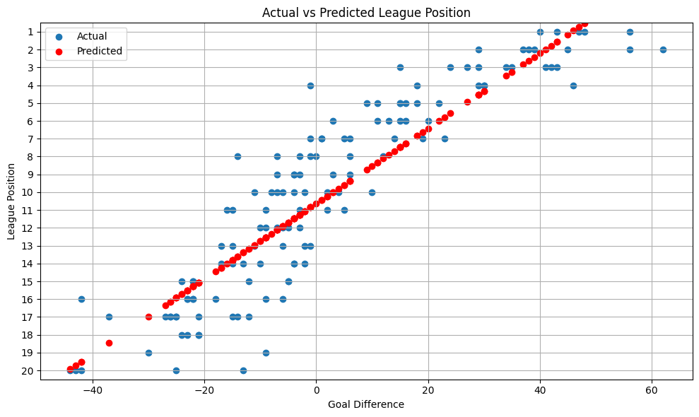
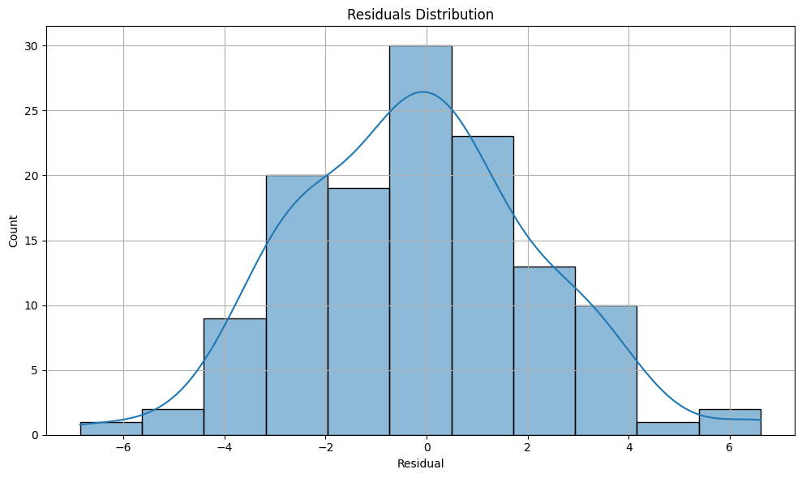

#⚽ Premier League Standings Predictor

A simple data science project that uses **linear regression** to predict final Premier League positions based on a team's goal difference.

## 📌 Objective
The aim of this project is to explore the relationship betweeen **goal difference** and **final league position** in teh English Premier League, and build a regression model to predict standings.

##💻 Tools Used
- Python
- pandas
- sckit-learn

##📊 Project Flow
1. Load historical Premier League data.
2. Perform exploratory data analysis (EDA) on goal difference and position.
3. Train a Linear Regression model.
4. Evaluate performance using R² Score and visual inspection.
5. Interpret the results and suggest improvements.

##🧠 Key Results
**Corelation:** Goal difference shows a strong negative correlation with final league position.
- **Model Accuracy:** Achieved an R² Score of 0.80 on test data.
- **Insight:** Goal difference alone is a strong, though not perfect, predictor of league finish.

## Visualisations

Here are some of the visualisations from the project:

- **League Position vs Goal Difference**:

**Residuals Distribution**:

## 🔧 How to Run
1. Clone this repositiory.
2. Install dependencies:
'''bash
pip install -r requirements.txt
'''

3. Open 'PremStandings.ipynb' in Jupyter Notebook or VSCode and run all cells.

##🚀 Future Improvemnets
- Include more fetaures like points, xG, clean sheets.
- Test other models: Ridge Regression, Random Forest.
- Automate data updates with web scraping.

---

Created by **Emmanuel Gyamfi**